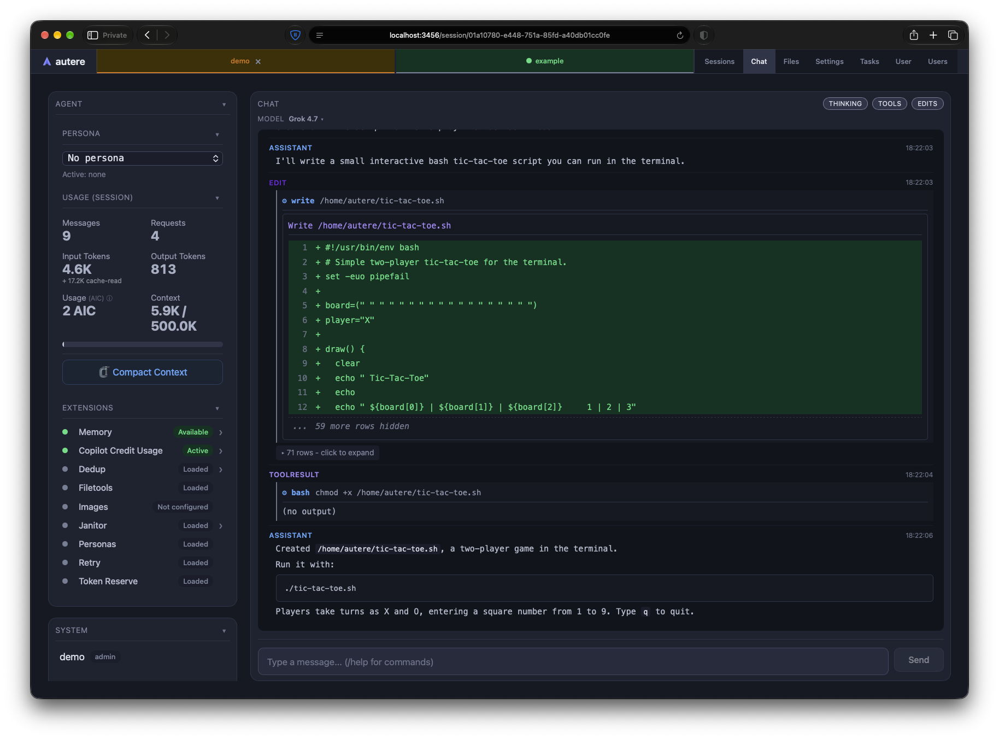

# autere

Autere is a web frontend and orchestrator for the [Pi Coding Agent](https://pi.dev/), with multi-user and multi-session support. Sessions are mutliplexed to all clients of a user - you can start on your laptop, move to your phone and continue the same session seamlessly.

Supports multiple users, allows sandboxing your Pi agents into docker containers with only specific directories mounted. Provides a full CLI for integrations. Use from anywhere, if you expose Autere over a network.




## Installation and Running

Build the docker image with the included `build.sh` script:

```bash
./build.sh                       # build with defaults
./build.sh -h                    # show build options
```

All configuration is via env variables (docker run / compose), see below for supported variables. 

```bash
docker run -d --name autere \
  -p 127.0.0.1:3456:3456 -p 127.0.0.1:20128:20128 \
  -e INITIAL_PASSWORD=secret \
  --group-add $(getent group docker | cut -d: -f3) \
  -v /var/run/docker.sock:/var/run/docker.sock \
  -v autere-home:/home/autere \
  randomcodemonkey.org/autere:latest
```

There is also an example [docker-compose.yaml](docker/docker-compose.yaml) available.

`/var/run/docker.sock` is required for sandboxed pi sessions - without it the backend cannot start session containers. Admin user may set 'sandbox' image to 'off' in their per-user settings, or disable sandboxing globally by setting env `AUTERE_SANDBOX_IMAGE=off`.

When mounting docker.sock inside the autere container, you **must** use `--group-add <gid>` in the docker run command, where gid matches the group of the socket inside the autere container (on linux this matches the group of the socket on the host, `getent group docker` - on MacOs it is easiest to mount the socket and check what group it ends up having)

`/home/autere` should be mounted into the autere container as a named volume (not a bind mount), sandboxed pi sessions require named volumes to function. 

The example [docker-compose.yaml](docker/docker-compose.yaml) also mounts shared config/cache volumes into the container — `~/.config`, `~/.cache`, `~/.npm`, `~/.m2`, `~/.ivy` — and sets `GIT_CONFIG_GLOBAL`, `XDG_CACHE_HOME` and `XDG_CONFIG_HOME` to match. These same volumes and env variables apply to sandboxed pi sessions too: the sandbox automatically mounts each shared dir at the identical path and forwards `XDG_CONFIG_HOME`/`XDG_CACHE_HOME` (and `GIT_CONFIG_GLOBAL` when the gitconfig exists), so sandboxed and non-sandboxed sessions share the same caches and git identity. Keep these mounts as named volumes — the sandbox mounts them by name.

### Initial configuration

Once started, the Autere Web UI is available at **http://localhost:3456** and 9router, if enabled, at **http://localhost:20128**.

The default `9router` instance requires an API key which you can obtain from the 9router dashboard. You will need to change the 9router password on first login, and add some provider(s) and model(s) to 9router before it can be used in Autere. Once 9router is configured, you need to configure the API key and 9router Web Dashboard password via *Settings -> 9Router* in the Autere Web UI.

### Using other providers

Autere is designed for 9router but can also run without it, by setting the `AUTERE_PROVIDER` env value to a valid `pi` provider. With this mode, you must manually configure the provider with `pi` through the running Autere docker instance:

```bash
docker exec -it autere pi
```

Enter `/login` to pi and follow the instructions for configuring your selected provider. See [Pi Providers documentation](https://pi.dev/docs/latest/providers) for details.

### Authentication

The fixed `admin` account is created on first start from `INITIAL_PASSWORD` (defaults to `admin`).

The CLI authenticates with the same accounts (`autere login admin <password>`), storing its token in `~/.autere/cli-config.json`.

### Running behind a proxy

Autere can be ran behind a proxy and supports the standard `x-forwarded-prefix` header to allow Autere to be proxied behind a non-root path.

### Configuration (system env)

| Variable | Default | Description |
|----------|---------|-------------|
| `AUTERE_PORT` | 3456 | HTTP server port |
| `AUTERE_AUTH` | true | Enable/disable authentication |
| `INITIAL_PASSWORD` | `admin` | Initial password for the `admin` user and 9router |
| `AUTERE_PROVIDER` | 9router | Pi provider |
| `AUTERE_MODEL` | - | Pi model ID |
| `AUTERE_IDLE_TIMEOUT` | 30 | Minutes before idle pi sessions are terminated |
| `AUTERE_NINE_ROUTER_URL` | `http://localhost:20128` | Backend-managed 9router URL |
| `AUTERE_SANDBOX_IMAGE` | randomcodemonkey.org/autere:latest | Docker image for sandboxed pi sessions (`off` disables sandbox mode) |

## Architecture

### Data files

Global (under `~/.autere/`):

| File | Contents |
|------|----------|
| `autere-users.json` | User registry (roles, password hashes, allowed dirs) - seeded on first start, authoritative afterwards |
| `autere-auth-tokens.json` | Active login tokens (30-day expiry) |
| `users/<user>/settings.json` | Per-user (persisted) settings values |
| `users/<user>/scheduled-tasks.json` (+ `scheduled-task-logs/`) | Scheduled tasks and run logs |

Per-user pi env (under `~/.autere/pi-envs/<user>/`):

| File | Contents |
|------|----------|
| `sessions/*.jsonl` | Pi session transcripts (current last id in `last-session.json`) |
| `file-changes/*.jsonl` | Per-session file change log (Files -> Session Edits) |
| `images/`, `uploads/` | Generated images / session attachments |
| `9router-config.json` | 9router endpoint + per-user settings overrides |
| `models.json` | pi model overrides (per-input-type forcing) |
| `settings.json` | pi settings for the session environment |
| `mcp.json` | MCP servers for this user's pi sessions (Settings → MCP Servers; seeded from the master pi env) |
| `janitor-config.json`, `dedup-stats.json` | Extension state (live-read) |

### REST API

All endpoints are versioned under `/api/v1`. The full machine-generated spec is served at
`/api/v1/openapi.json` - no endpoint list is kept in this document.

Run Swagger UI against a local backend:

```bash
docker run --rm -p 8081:8080 -e SWAGGER_JSON_URL=http://localhost:3456/api/v1/openapi.json swaggerapi/swagger-ui
# open http://localhost:8081 - for auth'd calls, first POST /api/v1/auth/login and set the returned bearer token via the Authorize button
```

### SSE

Stream: `GET /api/v1/events` (per-user, scoped to the viewed session where applicable). Heartbeats every 3s.

| Event | Data |
|-------|------|
| `status` | session state (model, isStreaming, compacting, sessionId, ...) |
| `stats` | token usage/cost |
| `stream_history` | full history snapshot (connect/reload) |
| `history_upsert` | entries appended or replaced by stable id |
| `history_remove` | entry ids removed |
| `stream_delta` | `{role, text}` of the streaming entry (throttled client-side) |
| `tool_start` / `tool_end` | tool lifecycle |
| `models` / `sessions` / `extensions` | resource lists |
| `navigate` | server-commanded frontend navigation |
| `new_session_creating` | new session creation in flight |
| `error` | error message |
| `heartbeat` | keep-alive |

History entry `role` values: `user`, `assistant`, `thinking`, `toolCall`, `toolResult`, `edit`, `file`, `image`. Non-renderable pi roles (e.g. `model_change`) are dropped.

## Troubleshooting

**Moving volumes / mountpoints (e.g. between docker volumes)**: every pi session transcript records its absolute `cwd` in the first JSONL line, and sessions whose recorded cwd no longer exists on the host are hidden from the Sessions list. If home directories move (new host, changed volume layout, different username), rewrite the paths once:

```bash
grep -rlF '/home/OLD' ~/.autere/pi-envs/*/sessions/ \
  | xargs sed -i 's|/home/OLD|/home/NEW|g'
```

The dir names under `sessions/` (e.g. `--home-autere--`) are derived from the cwd and can stay as-is, but the cwd *inside* each file must match a directory that exists on the current host.

## License

MIT

This service uses icons from the Font Awesome Free icon set ([fontawesome.com](https://fontawesome.com)), licensed under [CC BY 4.0](https://creativecommons.org/licenses/by/4.0/).
